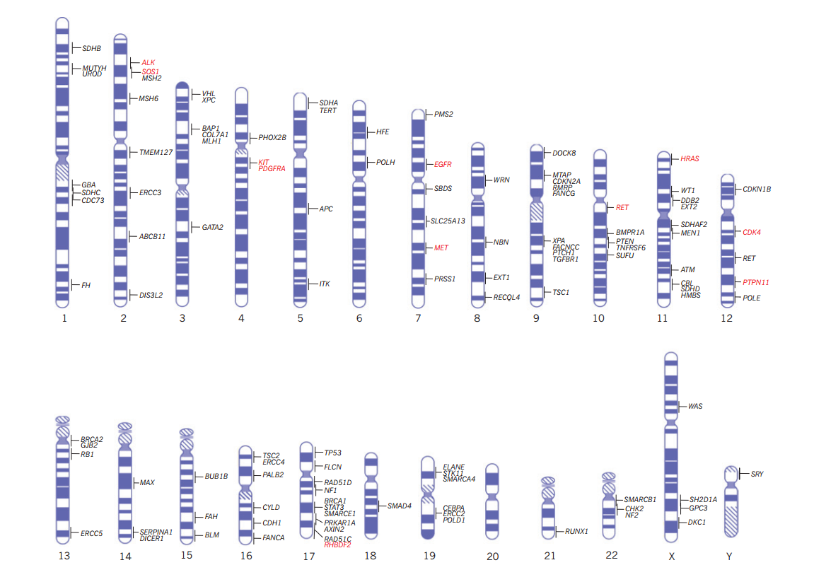

# CPGs: Cancer prediposition genes

> Genes in which germline mutations confer highly or moderately increased risks of cancer are called cancer predisposition genes.

Chromosomal locations of 114 cancer predisposition genes. Gain-of-function mutations in genes that predispose carriers to cancer are shown in
red. Loss-of-function mutations in genes that predispose carriers to cancer are shown in black.

[reference](http://www.nature.com/nature/journal/v505/n7483/full/nature12981.html)
